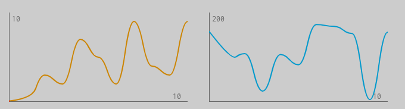

# flowingChart

Flowing Chart Web Component



## Features

- A totally independent **Web Component**
- CSS Encapsulation with **Shadow DOM**
- Takes sync or **async** iterators as data input
- Uses the **Canvas API**
- Stops, waits and continues automatically
- Everything is **customizable**

## Demo

Click [**here**](https://timonson.github.io/flowingChart/)

## Quick Start

```shell
npm start
```

## Api

```
"width",
"height",
"xMax",
"yMax",
"chartColor",
"axisColor",
"lineWidth",
"iterator"
```

## Example

```html
<flowing-chart iterator="0327529439" x-max="10" y-max="10" chart-color="orange">
</flowing-chart>
```

For more animated and asynchronous examples look into the
[**example**](https://github.com/timonson/flowingChart/tree/master/example)
folder.
