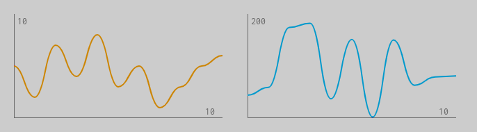

# flowingChart

Flowing Chart Web Component



## Features

- An independent **Web Component**
- CSS Encapsulation with **Shadow DOM**
- Takes sync or **async** iterators as data input
- Uses the **Canvas API**
- Stops, waits and continues automatically
- Everything is **customizable**

## Demo

[Click](https://timonson.github.io/flowingChart/)

## Quick Start

Serve the `demo.html` to your browser.

## Api

```
"width",
"height",
"iterator"
"x-max",
"y-max",
"chart-color",
"axis-color",
"line-width",
```

## Example

```html
<flowing-chart iterator="0327529439" x-max="10" y-max="10" chart-color="orange">
</flowing-chart>
```
